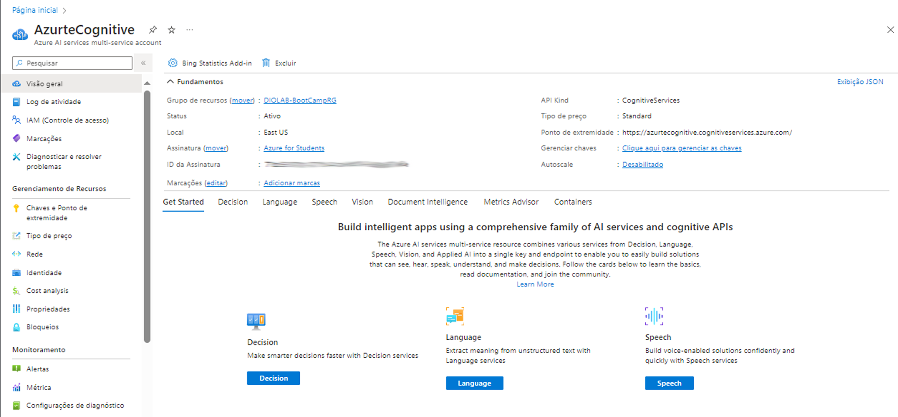
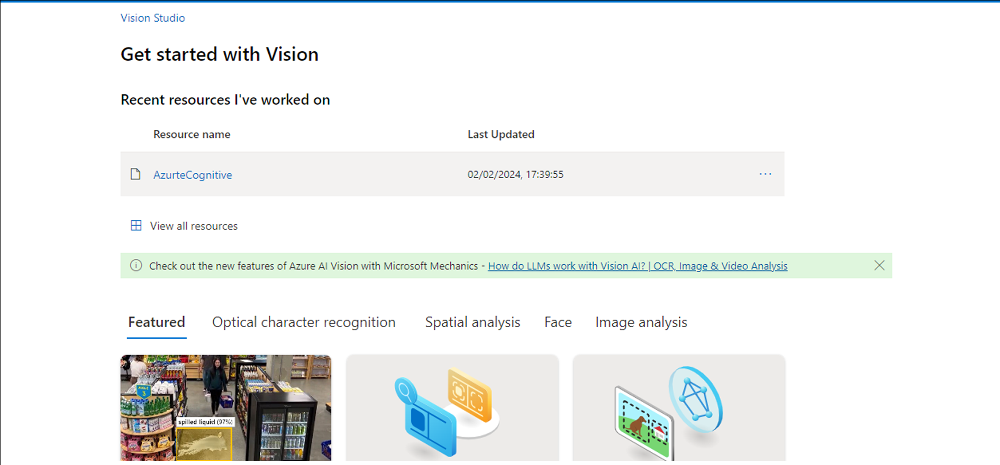
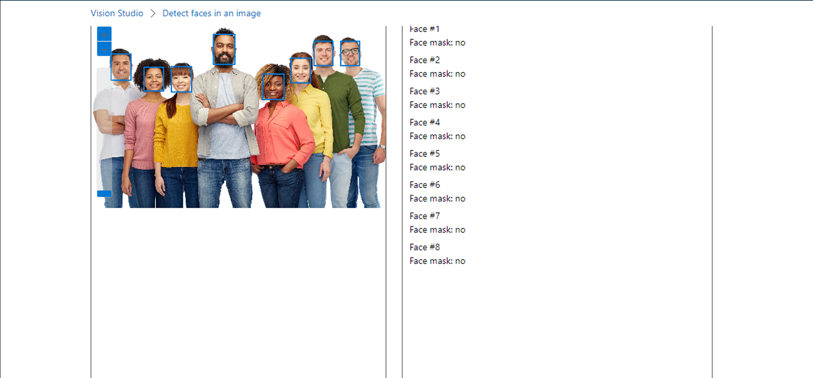
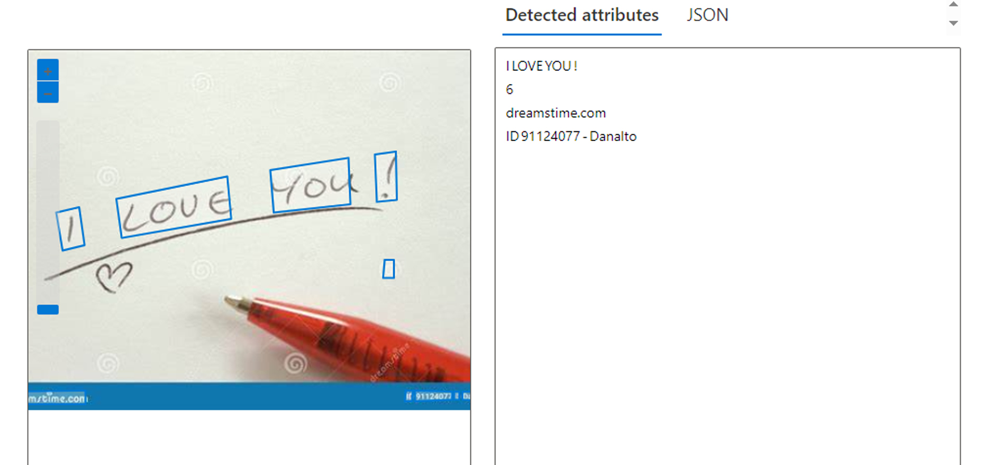
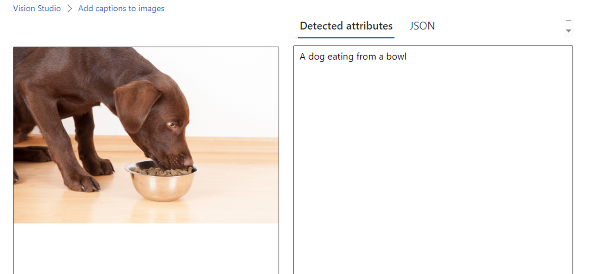
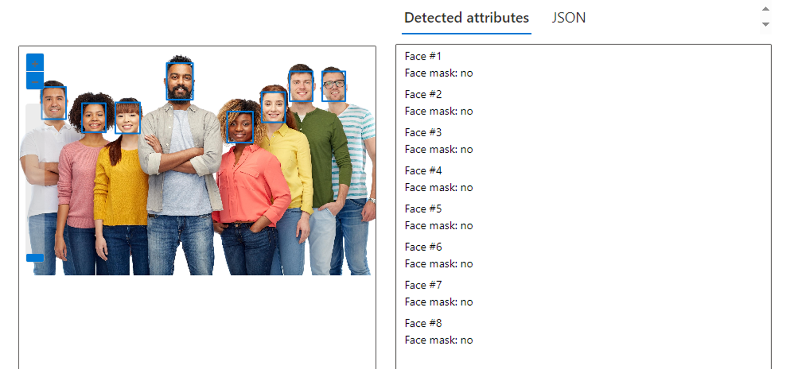

## azureVisionAI-CpationToImage-OCR-faceDetect
 Reconhecimento Facial e transformação de imagens em Dados no Azure ML

### Primeira Etapa

Configuração do Serviço, cria um grupo de recursos no Portal do Azure, com os Azure Service - Serviços Cognitivos

### Segunda Etapa
Após a configuração do Grupo de Recursos, acessado o portal da AI Vision Studio e realizeir os teste de OCR, Legendas Para Imagens, e reconhecimento facial.

### Terceita Etapa 

Obtendo os seguintes outputs:

## Links Úteis

 - [Repositório GitHub](https://github.com/GustavoSirkis/azureVisionAI-CpationToImage-OCR-faceDetect)
 - [Documentação Azure Vision Studio](https://learn.microsoft.com/en-us/azure/ai-services/computer-vision/)

